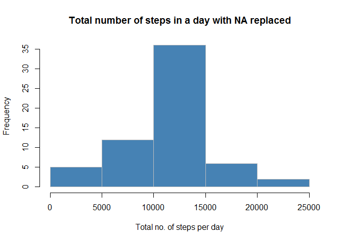

# Reproducible Research: Peer Assessment 1

The steps followed to complete the assignment are:

###1. Load the data as a Data Table and preprocess it


```r
#First set the working directory to be the cloned repository

library(data.table)
library(lubridate)
```

```
## 
## Attaching package: 'lubridate'
## 
## The following objects are masked from 'package:data.table':
## 
##     hour, mday, month, quarter, wday, week, yday, year
```

```r
library(ggplot2)
activity<-fread("activity.csv")

#Convert date variable from char to Date and interval to posixct

activity$date<-as.Date(activity$date,"%Y-%m-%d")
activity$interval<-fast_strptime(sprintf("%04d", activity$interval),"%H%M")
```
  

###2. Calculate the mean total number of steps taken per day


```r
#drop the rows having missing values

activityclean<-activity[!is.na(activity$steps),]

#calculate total number of steps taken per day and plot as histogram

sumsteps<-activityclean[,sum(steps),by=date]
setnames(sumsteps,c("date","V1"),c("date","tot_steps"))
hist(sumsteps$tot_steps,main="Frequency of total number of steps in a day",xlab="Total no. of steps per day",col="steelblue",border="gray")
```

 

```r
#calculate the mean and median of the total number of steps in a day

print(matrix(data=c(mean(sumsteps$tot_steps),median(sumsteps$tot_steps)),nrow=1,ncol=2,dimnames=list(" ",c("Mean","Median"))))
```

```
##       Mean Median
##   10766.19  10765
```

  
###3. Plot the average daily activity pattern


```r
#calculate the mean/average number of steps over all days in each interval and plot as a timeseries plot

avginterval<-activityclean[,mean(steps),by=interval]
setnames(avginterval,c("interval","V1"),c("interval","avg_steps"))
plot(avginterval$interval,avginterval$avg_steps,type="l",main="Avg. number of steps across intervals for all days",xlab="Intervals",ylab="Avg. number of steps")
```

 

```r
#print the interval with the highest avg. number of steps

print(avginterval[which.max(avginterval$avg_steps),])
```

```
##               interval avg_steps
## 1: 0000-01-01 08:35:00  206.1698
```


###4. Impute missing values and observing changes in the mean, median and total number of steps


```r
#Calculate the number of rows with missing values

sum(!complete.cases(activity))
```

```
## [1] 2304
```

```r
#Replace the NA values with mean of all steps (without NA) over that interval

activityrepNA<-activity[,steps := as.integer(ifelse(is.na(steps), as.numeric(mean(steps, na.rm=TRUE)), as.numeric(steps))), by=interval]

#Make a histogram of the total number of steps taken each day 

sumsteps2<-activityrepNA[,sum(steps),by=date]
setnames(sumsteps2,c("date","V1"),c("date","tot_steps"))
hist(sumsteps2$tot_steps,main="Total number of steps in a day with NA replaced",xlab="Total no. of steps per day",col="steelblue",border="gray")
```

 

```r
#Calculate and report the mean and median total number of steps taken per day. Also find the  difference from the estimates from the first part of the assignment 

print(matrix(data=c(mean(sumsteps2$tot_steps),median(sumsteps2$tot_steps),mean(sumsteps$tot_steps),median(sumsteps$tot_steps),mean(sumsteps2$tot_steps)-mean(sumsteps$tot_steps),median(sumsteps2$tot_steps)-median(sumsteps$tot_steps)),nrow=2,ncol=3,dimnames=list(c("Mean","Median"),c("New","Old","Difference"))))
```

```
##             New      Old Difference
## Mean   10749.77 10766.19  -16.41819
## Median 10641.00 10765.00 -124.00000
```

```r
#Calculate impact of imputing missing data on the estimates of the total daily number of steps

print(matrix(data=c(sum(sumsteps2$tot_steps),sum(sumsteps$tot_steps),sum(sumsteps2$tot_steps)-sum(sumsteps$tot_steps)),nrow=1,ncol=3,dimnames=list(" ",c("New","Old","Difference"))))
```

```
##      New    Old Difference
##   655736 570608      85128
```

###5. Observe the differences in activity patterns between weekdays and weekends


```r
#Create a new factor variable in the dataset with two levels - "weekday" and "weekend" indicating whether a given date is a weekday or weekend day.

activityrepNA[,daytype := as.factor(ifelse(weekdays(activityrepNA$date,abbreviate=FALSE)=="Sunday" | weekdays(activityrepNA$date,abbreviate=FALSE)=="Saturday","Weekend", "Weekday"))]
```

```
##        steps       date            interval daytype
##     1:     1 2012-10-01 0000-01-01 00:00:00 Weekday
##     2:     0 2012-10-01 0000-01-01 00:05:00 Weekday
##     3:     0 2012-10-01 0000-01-01 00:10:00 Weekday
##     4:     0 2012-10-01 0000-01-01 00:15:00 Weekday
##     5:     0 2012-10-01 0000-01-01 00:20:00 Weekday
##    ---                                             
## 17564:     4 2012-11-30 0000-01-01 23:35:00 Weekday
## 17565:     3 2012-11-30 0000-01-01 23:40:00 Weekday
## 17566:     0 2012-11-30 0000-01-01 23:45:00 Weekday
## 17567:     0 2012-11-30 0000-01-01 23:50:00 Weekday
## 17568:     1 2012-11-30 0000-01-01 23:55:00 Weekday
```

```r
#Make a panel plot containing a time series plot (i.e. type = "l") of the 5-minute interval (x-axis) and the average number of steps taken, averaged across all weekday days or weekend days (y-axis).

avginterval2<-activityrepNA[,mean(steps),by=list(daytype,interval)]
setnames(avginterval2,c("daytype","interval","V1"),c("daytype","interval","avg_steps"))
qplot(interval,avg_steps,data=avginterval2,facets=daytype~.,geom="path")
```

 
